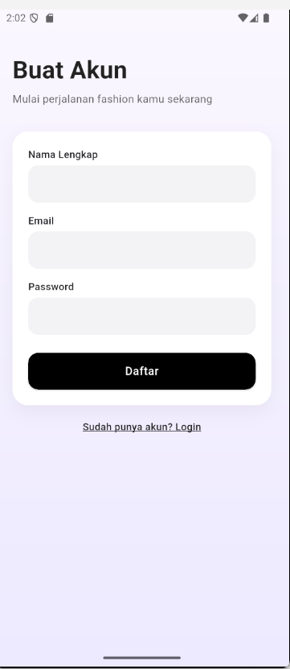
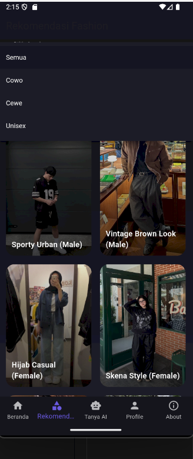
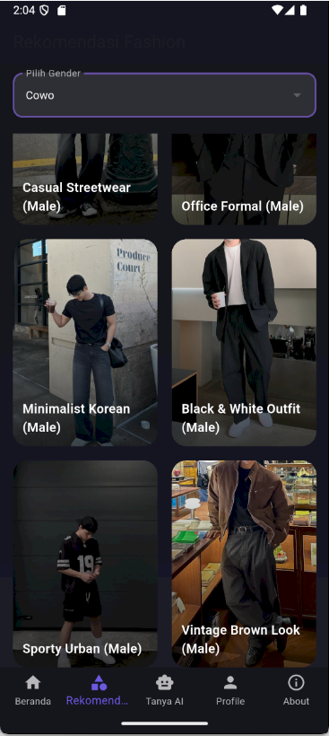
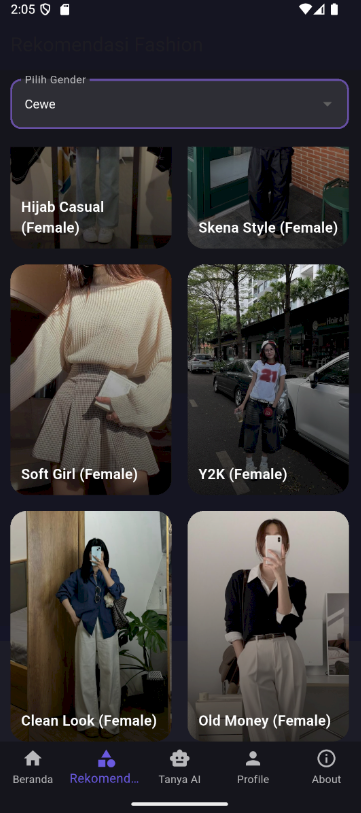
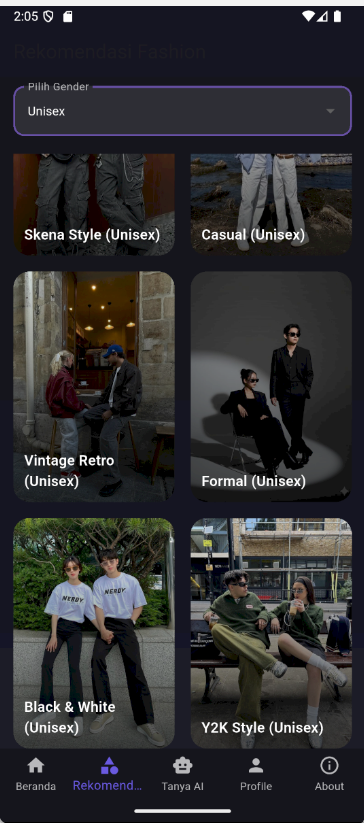
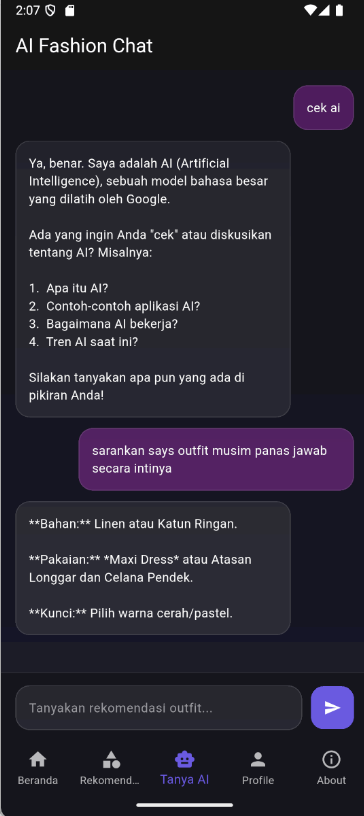
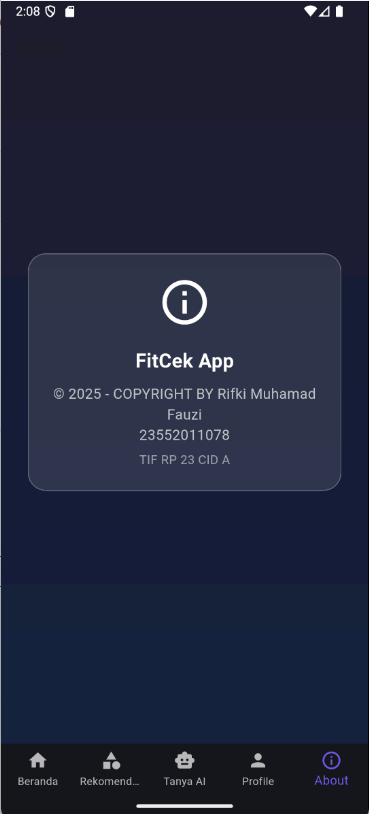

# 👗 FitCek – Aplikasi Rekomendasi Fashion (Flutter)

Fitcek adalah aplikasi mobile bertema **fashion recommender** yang menggunakan **Google Gemini AI** untuk memberikan saran outfit, style, warna pakaian, dan inspirasi fashion lainnya.  
Aplikasi ini dibuat sebagai bagian dari **UTS Pemrograman Mobile 2**.

---
## Ada SplashScreen dengan logo aplikasi

## ✨ Fitur Utama

### Login(SqlLite)
- User harus login terlebih dahulu untuk masuk aplikasi
- Jika tidak mempunyai akun maka harus register
- Login menggunakan database SQLite

### Register
- Jika user tidak mempunyai akun maka di haruskan register untuk membuat akun

### 🏠 Beranda
- Rekomendasi outfit harian
- Jenis pakaian (kaos, hoodie, kemeja, dll.)
- Tombol cepat: **Tanya AI**

### ⭐ Rekomendasi Page
- Grid List Rekomendasi Outfit
- Ada fitur pilih gender untuk memilih outfit sesuai gender (cowo,cewe,unisex)

### 🤖 Tanya AI (Gemini)
- Konsultasi fashion ke AI
- Powered by **Google Gemini API**

### 👤 Profile
- Menampilkan nama & email user
- Tombol Logout

### ℹ About Page
-Untuk CopyRight

-----------||--------------------------------------------||---------------------||---------------
## 📸 Screenshot Aplikasi

### Login Page 

### Reguster Page 

### Beranda  

### Rekomendasi  

### Tanya AI  

### Profile  

### About

## Data Diri
Nama : Rifki Muhamad Fauzi 
Nim : 23552011078 
Kelas : TIF RP 23 CID A 
Pengumpulan UTS PEMOB 2 APlikasi FitCek(untuk rekomendasi outfit) berbasis android dengan menggunakan flutter
